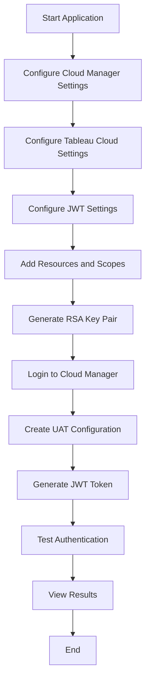

# Tableau UAT Configuration Tool

## Table of Contents
- [Objective](#objective)
- [Project Architecture](#project-architecture)
- [Flow Chart](#flow-chart)
- [How to Install and Run with Docker](#how-to-install-and-run-with-docker)
- [How to Run the App (Local)](#how-to-run-the-app-local)
- [Usage Guide](#usage-guide)
- [Getting Help](#getting-help)

## Objective

The Tableau UAT (Unified Access Token) Configuration Tool is designed to simplify the process of configuring and testing JWT-based authentication for Tableau Cloud and Tableau Cloud Manager. This tool provides a user-friendly interface to:

1. Generate RSA key pairs for JWT signing
2. Configure UAT settings in Tableau Cloud Manager
3. Create and validate JWT tokens
4. Test API authentication with both Tableau Cloud and Cloud Manager
5. Manage resource access permissions through scopes
6. Monitor signed UAT(s).
7. Revoke UAT(s).

## Project Architecture

The application is built using Python and Gradio, with a modular architecture consisting of several components:

```
Tableau UAT Configuration Tool
├── app.py                   # Main application with Gradio UI
│               
├── requirements.txt         # Python dependencies
├── scope_data.py            # Scope definitions and common actions
├── auth/                    # Authentication modules
│   ├── __init__.py
│   ├── cloud_manager_auth.py # Cloud Manager authentication
│   ├── jwt_builder.py       # JWT token creation
│   ├── keygen.py            # RSA key pair generation
│   ├── tableau_auth.py      # Tableau Cloud authentication
│   └── uat_config.py        # UAT configuration management
├── managers/                # Resource management modules
│   ├── __init__.py
│   ├── resource_managers.py # Project, Workbook, Datasource, Flow managers
│   ├── scope_manager.py     # Scope management
│   └── site_manager.py      # Site management
├── testing/                 # API testing modules
│   ├── __init__.py
│   └── api_testing.py       # API testing functionality
├── utils/                   # Utility modules
│   ├── __init__.py
│   └── helpers.py           # Helper functions
├── Dockerfile               # Docker configuration
├── docker-compose.yml       # Docker Compose configuration
├── .env                     # Environment variables (not in repo)
└── keys/                    # Generated RSA keys (not in repo)
    ├── private_key.pem
    └── public_key.pem
```

### Key Components

1. **app.py**: Main application file containing the Gradio UI and workflow orchestration
2. **requirements.txt**: Lists all Python dependencies needed for the project
3. **auth/**: Authentication-related modules
   - `keygen.py`: Generates RSA key pairs for JWT signing
   - `jwt_builder.py`: Creates JWT tokens with appropriate claims
   - `cloud_manager_auth.py`: Handles authentication with Cloud Manager
   - `uat_config.py`: Manages UAT configurations in Cloud Manager
   - `tableau_auth.py`: Handles authentication with Tableau Cloud
4. **managers/**: Resource management classes
   - `site_manager.py`: Manages Tableau sites
   - `resource_managers.py`: Manages projects, workbooks, datasources, flows
   - `scope_manager.py`: Manages JWT scopes
5. **testing/**: API testing functionality
   - `api_testing.py`: Tests authentication with various APIs
6. **utils/**: Utility functions
   - `helpers.py`: Common helper functions
7. **scope_data.py**: Defines available scopes and actions for different resource types

## Flow Chart



### How to Install and Run with Docker

1. **Build and run the Docker container**:
   ```bash
   # Build the image
   docker build -t tableau-uat-tool .
    
   # Run with Docker Compose (recommended)
   docker compose up -d
   ```
2. **Access the application**:
   Open your web browser and navigate to `http://localhost:7860`

3. **Stop the container**:
   ```bash
   # If using Docker Compose
   docker compose down

   # If running directly with Docker
   docker stop tableau-uat-tool
   ```

## How to Run the App (Local)

1. **Clone the repository**:
   ```bash
   git clone https://github.com/mok3bat/Tableau-Cloud-Unified-Access-Token-Tool.git
   cd Tableau-Cloud-Unified-Access-Token-Tool
   ```

2. **Create a virtual environment**:
   ```bash
   python -m venv venv
   source venv/bin/activate  # On Windows: venv\Scripts\activate
   ```

3. **Install dependencies**:
   ```bash
   pip install -r requirements.txt
   ```

4. **Run the application**:
   ```bash
   python app.py
   ```

5. **Access the application**:
   Open your web browser and navigate to `http://localhost:7860`

## Usage Guide

### 1. Configuration Tab

#### Cloud Manager Settings
- Enter your Tenant ID, PAT Secret, and API URLs
- These credentials are used to authenticate with Tableau Cloud Manager

#### Tableau Cloud Settings
- Enter your Pod URL and Username
- Add one or more sites you want to access with the token
- For each site, provide the Site ID (contentUrl), Site LUID, and select the appropriate scope

#### JWT Configuration
- Enter the Issuer value for your JWT tokens
- Set the Token Lifetime (how long the JWT will be valid)
- Configure Resource Access Control for different resource types (Tenant, Projects, Workbooks, etc.)

### 2. Testing Tab

#### JWT Authentication Tests
- Test your JWT authentication with both Cloud Manager and Tableau Cloud APIs
- View cURL commands for manual testing

#### UAT Configuration Management
- List all UAT configurations in your Cloud Manager tenant
- View detailed information about each configuration
- Revoke a selected configuration.

### 3. Workflow

1. Configure all necessary settings in the Configuration tab
2. Click "Start UAT Configuration Workflow" to:
   - Generate RSA key pair
   - Authenticate with Cloud Manager
   - Create UAT configuration
   - Generate JWT token
3. Test the authentication in the Testing tab
4. Use the generated JWT token in your applications

### Getting Help

If you encounter issues not covered here, please:
1. Check the application logs for detailed error messages
2. Verify all configuration values are correct
3. Ensure you have the necessary permissions in Tableau Cloud Manager
4. Check that all module imports are working correctly with the new structure
5. Create an issue in the project repository with details about the problem
